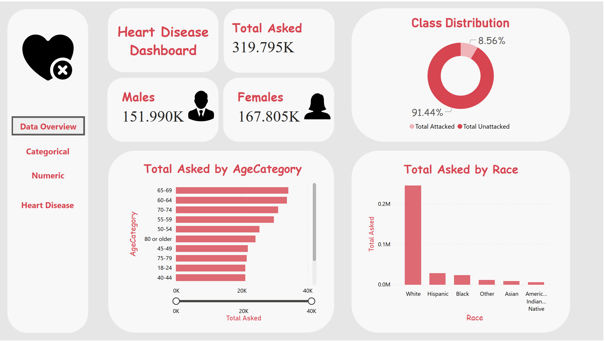

# 🫀 Heart Disease Dashboard — Power BI Project

Welcome to the **Heart Disease Dashboard** project!  
This repository contains a Power BI dashboard designed to analyze and visualize health-related behaviors and medical conditions that can influence the risk of heart disease.

The project demonstrates the process of **data mining**, transformation, and interactive visual reporting to uncover meaningful insights from health survey data.

---

## 💡 Project Overview

Heart disease remains one of the leading causes of death worldwide. Through the power of **visual analytics** with Microsoft Power BI, this project explores the relationship between lifestyle choices, health conditions, and the likelihood of heart disease, aiming to assist healthcare practitioners, analysts, and curious minds in data-driven decision making.

| 🔧 **Tool**              | 💡 **Techniques Applied**                |
|---------------------------|------------------------------------------|
| Microsoft Power BI        | Data Mining, Cleaning, Feature Analysis, Visualization |

---

## 🗂️ Repository Structure

```plaintext
HeartDisease-Dashboard/
├── data/
│   └── heart_disease_data.csv
├── images/
│   ├── Page1.png
│   ├── Page2.png
│   ├── Page3.png
│   ├── Page4.png
│   └── Page5.png
├── HeartDisease_Dashboard.pbix
└── README.md 
```
---

## 🧾 Dataset Features

The dataset contains the following columns:

| Column Name           | Description |
|-----------------------|-------------|
| `HeartDisease`        | Indicates whether the individual has heart disease |
| `BMI`                 | Body Mass Index |
| `Smoking`             | Whether the individual has smoked at least 100 cigarettes in their lifetime |
| `AlcoholDrinking`     | Whether the individual is a heavy drinker |
| `Stroke`              | History of stroke |
| `PhysicalHealth`      | Number of days physical health was not good (0–30) |
| `MentalHealth`        | Number of days mental health was not good (0–30) |
| `DiffWalking`         | Difficulty walking or climbing stairs |
| `Sex`                 | Gender of the individual |
| `AgeCategory`         | Age range category |
| `Race`                | Race or ethnicity |
| `Diabetic`            | Diabetic status |
| `PhysicalActivity`    | Participation in physical activity in past 30 days |
| `GenHealth`           | General health status (Excellent to Poor) |
| `SleepTime`           | Average hours of sleep per day |
| `Asthma`              | Whether the individual has asthma |
| `KidneyDisease`       | History of kidney disease |
| `SkinCancer`          | History of skin cancer |

---

## 🖼️ Dashboard Previews

Below is the main overview page of the Power BI dashboard. It provides a high-level summary of the most important metrics and visual insights derived from the data.



---

## 🚀 Getting Started

1. **Clone the repository:**
   ```bash
   git clone https://github.com/Aymen-Besbes/Aymen-Besbes-HeartDisease_Dashboard.git
2. **Open HeartDisease_Dashboard.pbix in Power BI Desktop**

---

## 🔍 Key Insights Explored

1. Correlation between lifestyle habits (smoking, drinking, sleep) and heart disease

2. Impact of chronic conditions like diabetes, asthma, and stroke

3. Demographic trends across age, gender, and race

4. Sleep and mental health as predictors of general health

---

## 📅 Project Timeline

- **Original creation date:** January 2024  
- **Upload to GitHub:** April 2025

---
## 📬 Contact
Author: Aymen Besbes

Email: Aymen.besbes@outlook.com | Aymen.besbes@ensi-uma.tn

LinkedIn: https://www.linkedin.com/in/aymen-besbes-158837245/
